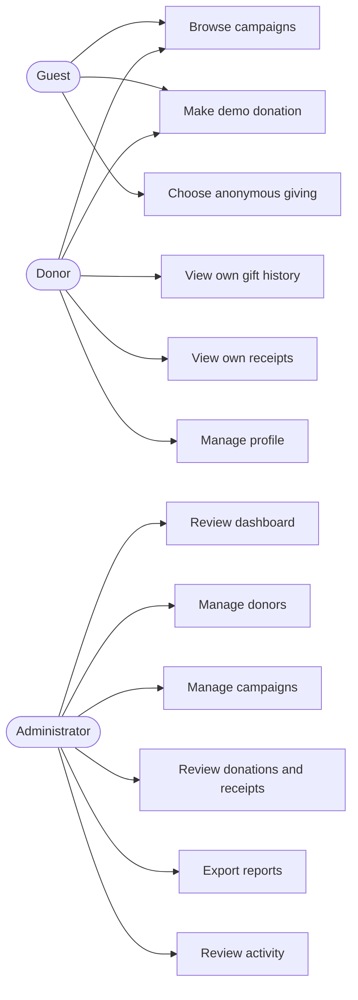
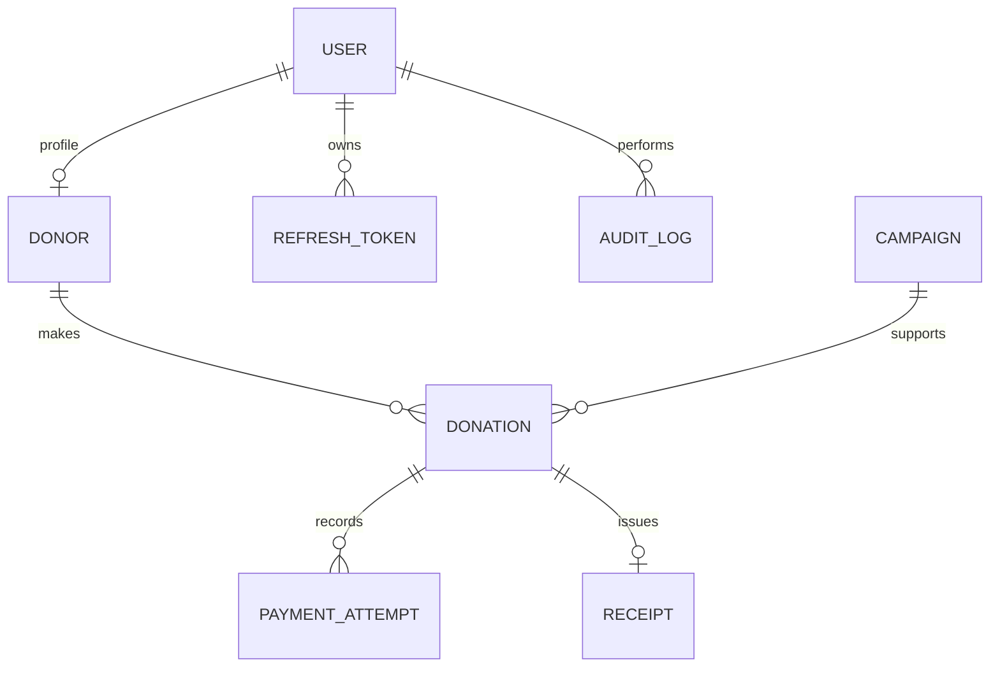
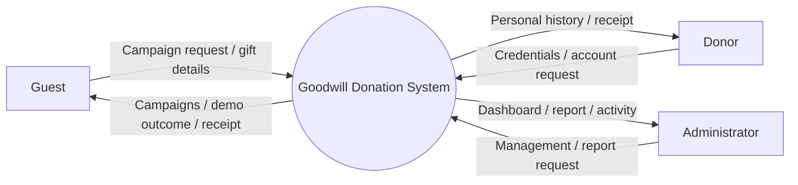
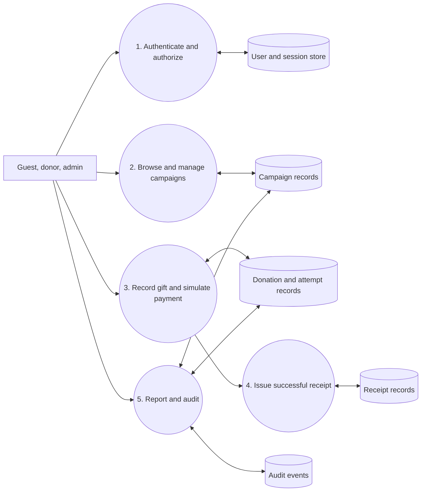
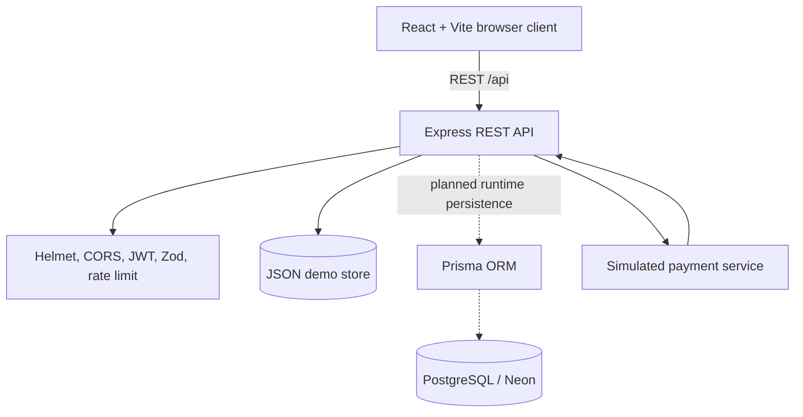

# System diagrams

## Use case diagram

```mermaid
flowchart LR
  Guest([Guest]) --> Browse[Browse campaigns]
  Guest --> Give[Make demo donation]
  Guest --> Anonymous[Choose anonymous giving]
  Donor([Donor]) --> Browse
  Donor --> Give
  Donor --> History[View own gift history]
  Donor --> Receipt[View own receipts]
  Donor --> Profile[Manage profile]
  Admin([Administrator]) --> Dashboard[Review dashboard]
  Admin --> Donors[Manage donors]
  Admin --> Campaigns[Manage campaigns]
  Admin --> Records[Review donations and receipts]
  Admin --> Reports[Export reports]
  Admin --> Audit[Review activity]
```

## ER diagram

```mermaid
erDiagram
 USER ||--o| DONOR : profile
 USER ||--o{ REFRESH_TOKEN : owns
 USER ||--o{ AUDIT_LOG : performs
 DONOR ||--o{ DONATION : makes
 CAMPAIGN ||--o{ DONATION : supports
 DONATION ||--o{ PAYMENT_ATTEMPT : records
 DONATION ||--o| RECEIPT : issues
```

## DFD level 0

```mermaid
flowchart LR
 Guest[Guest] -->|Campaign request / gift details| System((Goodwill Donation System))
 Donor[Donor] -->|Credentials / account request| System
 Admin[Administrator] -->|Management / report request| System
 System -->|Campaigns / demo outcome / receipt| Guest
 System -->|Personal history / receipt| Donor
 System -->|Dashboard / report / activity| Admin
```

## DFD level 1

```mermaid
flowchart LR
 A[Guest, donor, admin] --> P1((1. Authenticate and authorize))
 P1 <--> D1[(User and session store)]
 A --> P2((2. Browse and manage campaigns))
 P2 <--> D2[(Campaign records)]
 A --> P3((3. Record gift and simulate payment))
 P3 <--> D3[(Donation and attempt records)]
 P3 --> P4((4. Issue successful receipt))
 P4 <--> D4[(Receipt records)]
 A --> P5((5. Report and audit))
 P5 <--> D2
 P5 <--> D3
 P5 <--> D5[(Audit events)]
```

## System architecture

```mermaid
flowchart TB
 Browser[React + Vite browser client] -->|REST /api| Express[Express REST API]
 Express --> Security[Helmet, CORS, JWT, Zod, rate limit]
 Express --> Demo[(JSON demo store)]
 Express -. planned runtime persistence .-> Prisma[Prisma ORM]
 Prisma -.-> DB[(PostgreSQL / Neon)]
 Express --> Sim[Simulated payment service]
 Sim --> Express
```
